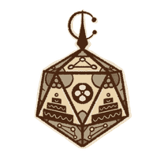
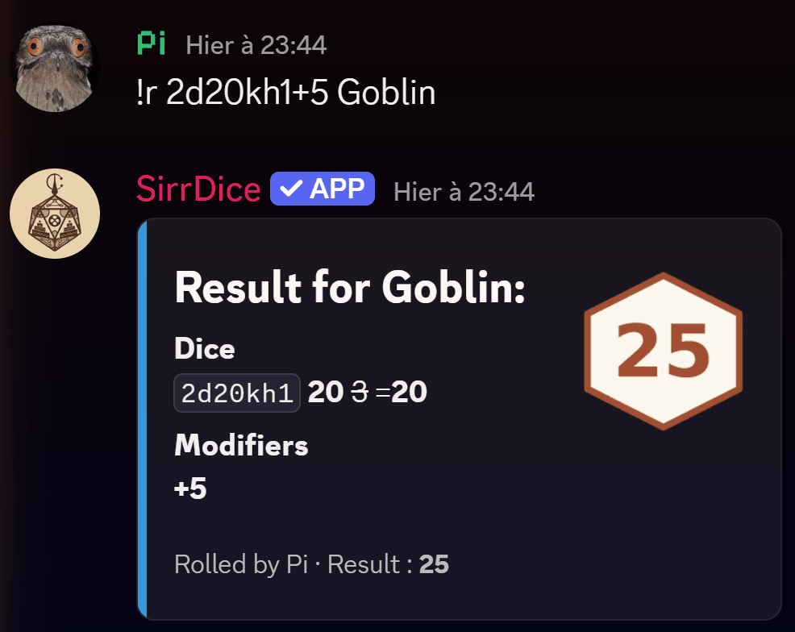

# SirrMizan

**Your emotional support dice thrower.**

A free dice bot for Discord, built for D&D, Pathfinder, Call of Cthulhu and every other tabletop RPG. It replies in English, French, German and Spanish, rolls with a cryptographically secure generator, and stores nothing about you.

[**Add to Discord**](https://discord.com/oauth2/authorize?client_id=1044351816307048508&permissions=19456&integration_type=0&scope=bot+applications.commands) ·
[Try it in your browser](https://sirrmizan.threatchaos.org/en/roll/) ·
[Website](https://sirrmizan.threatchaos.org/en/) ·
[top.gg](https://top.gg/bot/1044351816307048508) ·
[Support server](https://discord.gg/wAbMMPnwbg)

---

## Try it in ten seconds

1. [Click here to invite the bot](https://discord.com/oauth2/authorize?client_id=1044351816307048508&permissions=19456&integration_type=0&scope=bot+applications.commands). You need the Manage Server permission.
2. Type `/roll 1d20` in any channel. Or `!r 1d20`, both always work.
3. That is the whole setup. No account, no character sheet, no configuration.

Not on Discord right now? The website has a [live playground](https://sirrmizan.threatchaos.org/en/roll/) that runs the exact same dice engine in your browser.

## Everything it rolls

One short expression per roll. The syntax is the same in every language and for every game system.

| You type | You get |
|---|---|
| `!r 1d20` | One twenty-sided die |
| `!r 2d6+3` | Two d6 plus a flat modifier |
| `!r 1d20+5 Goblin` | A named roll, so the table knows who you are swinging at |
| `!r 2d20kh1+5` | Advantage: two d20, keep the highest, add 5 |
| `!r 2d20kl1` | Disadvantage: keep the lowest |
| `!r 4d6kh3` | One D&D ability score: four d6, keep the best three |
| `!r 6#4d6kh3` | A full set of six ability scores in one message |
| `!r 4d6dl1` | Drop the lowest die instead |
| `!r 1d100` | Percentile, for Call of Cthulhu and friends |
| `!r 2d6+1d4+3` | Mix any dice and modifiers freely |
| `!r` | Your server's default roll, if one is set |

There is no keyword to memorize beyond `kh`, `kl`, `dh`, `dl` and the `N#` repeat. Advantage is not a special mode, it is just `2d20kh1`, which means the same logic works for every house rule you can spell with dice.

Limits, so nobody floods a channel: 50 dice per term, 20 repeats, 100 characters per command.

Full reference: [docs/dice-syntax.md](docs/dice-syntax.md) · per-game guides for [D&D 5e](https://sirrmizan.threatchaos.org/en/dnd-5e-dice-bot/), [Pathfinder 2e](https://sirrmizan.threatchaos.org/en/pathfinder-2e-dice-bot/) and [Call of Cthulhu](https://sirrmizan.threatchaos.org/en/call-of-cthulhu-dice-bot/).

## Commands

Every command works both as a `/slash` command and with the prefix (`!` by default, changeable per server).

| Command | What it does |
|---|---|
| `/roll [expression] [target]` | Roll dice. The only command most tables ever need. |
| `/help` | The full command list, in your server's language. |
| `/setcolor` · `/getcolor` | Pick the embed color for your own rolls. |
| `/setrollshort on\|off` | One-line results, for busy channels. |
| `/forgetme` | Delete everything the bot knows about you, immediately. |
| `/defaultroll <expr>` | Server default for a bare `!r`. Admin only. |
| `/setlang en\|fr\|de\|es` | Bot language for this server. Admin only. |
| `/setprefix <prefix>` | Your own prefix. Admin only. |

Details and examples: [docs/commands.md](docs/commands.md).

## Fair dice, provably

Every roll comes from `secrets.SystemRandom`, Python's interface to the operating system's cryptographically secure random source. That is the same class of generator that protects passwords and encryption keys.

Why it matters at a table: ordinary pseudo-random generators follow a sequence that can be predicted by anyone who knows the seed. A CSPRNG cannot be predicted by anyone, including us. When the dice decide whether the rogue survives, nobody should have to take the bot's word for it, so this is documented here and on the site rather than left as an implementation detail.

## Privacy by absence

The honest description of our data practices is a list of things that do not exist:

- No user IDs stored.
- No message content stored.
- No roll history stored.
- No analytics, no trackers.

What the bot keeps is a couple of per-server settings (prefix, language, default roll) and, if you set them, your embed color and compact-output preference. `/forgetme` deletes your part of that on the spot. The full policy is two screens long and written for humans: [privacy policy](https://sirrmizan.threatchaos.org/en/privacy/).

## Four languages, really

`/setlang es` once, and the whole table plays in Spanish: replies, help, errors. Same for English, French and German. The website ships in the same four languages, so the docs you link to your players match the bot they use.

[English](https://sirrmizan.threatchaos.org/en/) · [Français](https://sirrmizan.threatchaos.org/fr/) · [Deutsch](https://sirrmizan.threatchaos.org/de/) · [Español](https://sirrmizan.threatchaos.org/es/)

## Everything is free

Every command, every language, every feature. No premium tier, no vote-locked features, no paywall waiting at level two. The bot is a hobby project run for the fun of running it.

## Philosophy: a dice bot, not a rules engine

SirrMizan deliberately does not manage character sheets, apply system rules, or judge your successes. The dice are rolled honestly and the maths is shown; reading the result against a DC or a skill value stays where it belongs, at the table.

That is a real trade-off, and if you want deep D&D 5e automation with sheet integration, [Avrae](https://avrae.io/) is excellent at exactly that. The comparison page on our site says plainly [when another bot is the better pick](https://sirrmizan.threatchaos.org/en/compare/).

What the small core buys you: zero setup, a syntax that works for any game ever printed, and a bot that has very little to break. The [status page](https://sirrmizan.threatchaos.org/en/status/) shows the uptime that approach produces, live.

## Reliability, in the open

- Live uptime and response times: [status page](https://sirrmizan.threatchaos.org/en/status/)
- Release history: [CHANGELOG.md](CHANGELOG.md), synced automatically from the private repository on every release
- Current version: the badge at the top of this page, same source

The bot runs on Python and py-cord, on self-managed infrastructure. The Discord application dates back to November 2022; versioned releases in their current form started in May 2026.

## Bugs, ideas, support

- Bug to report? [Open an issue](../../issues/new/choose). The template asks for the three things that make it fixable.
- Feature idea? [Same door](../../issues/new/choose). The philosophy section above explains what is likely to be declined and why.
- Prefer talking? [Support server on Discord](https://discord.gg/wAbMMPnwbg).

## About this repository

The bot's source code is closed; this repository is its public face: documentation, changelog, version file, issue tracker. Everything here is kept in sync with the deployed bot.

Text and documentation © Phobetore. Quote freely with a link. Artwork by [ladymagpie](https://sirrmizan.threatchaos.org/en/), all rights reserved.
